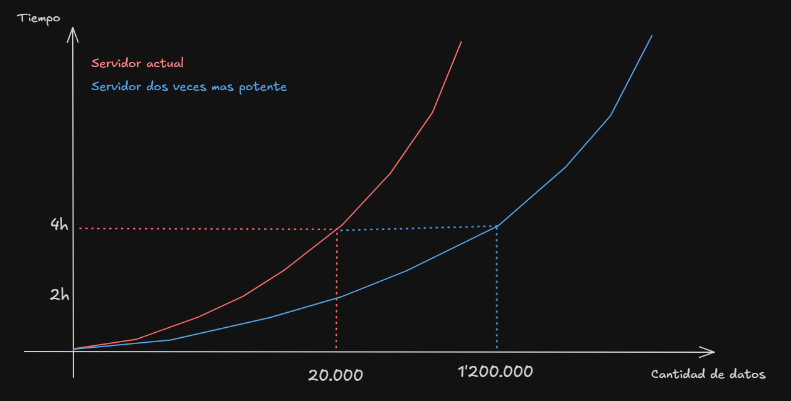
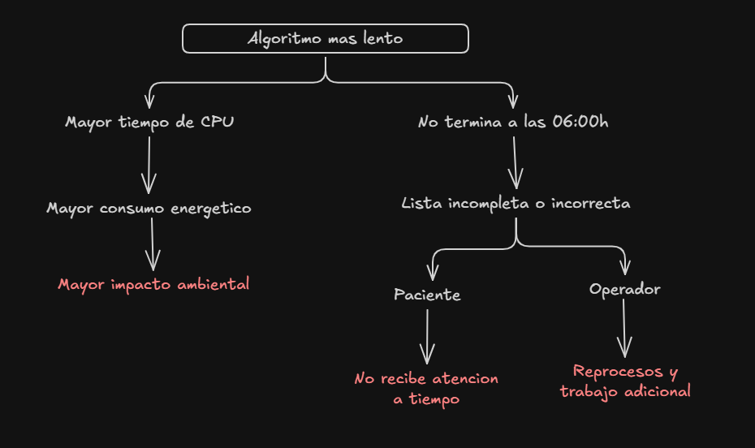
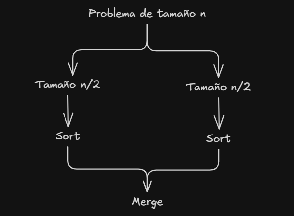
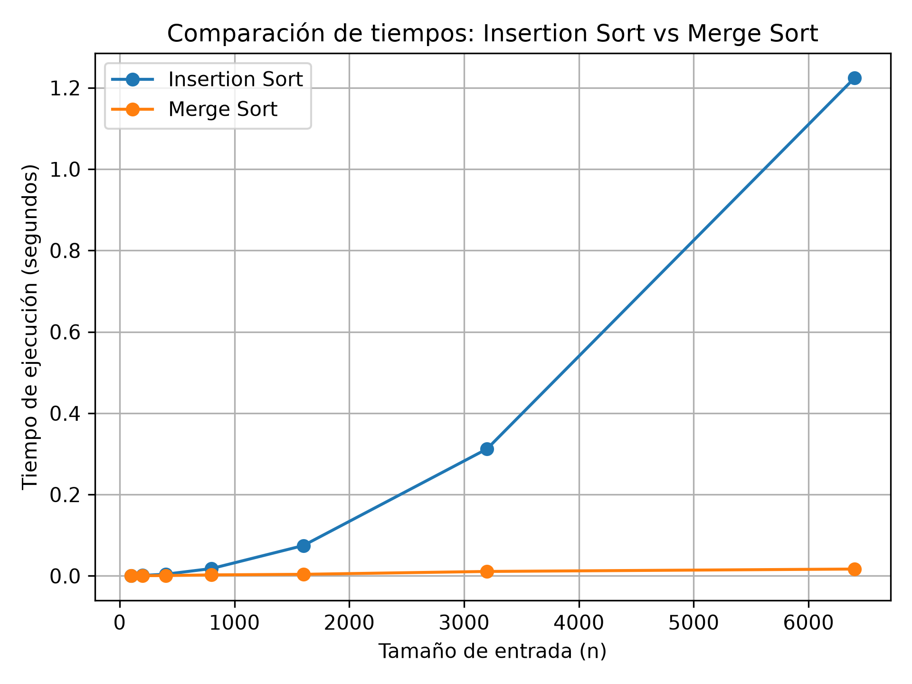

# **Laboratorio 1: Fundamentos, complejidad y recurrencias (Tamiza)**


## Introducción

El análisis de algoritmos permite determinar si una solución no solamente funciona correctamente, sino también si es adecuada para las condiciones en las que debe ejecutarse. En sistemas que manejan grandes cantidades de información, elegir un algoritmo adecuado puede tener un impacto importante en el tiempo de ejecución, el uso de recursos y la capacidad del sistema para cumplir sus restricciones.

En este laboratorio se analiza el caso de la plataforma **Tamiza**, utilizada por la secretaría de Salud para gestionar resultados de pruebas de tamizaje cardiovascular. La plataforma fue creada hace ocho años, cuando el programa cubría 4 municipios y unos 20.000 registros, actualmente debe ordenar 1.200.000 según el índice de riesgo de cada paciente antes de que inicie la jornada del centro de contacto. Actualmente se utiliza **insertion sort**, pero el crecimiento de la cantidad de registros ha provocado que el proceso no termine dentro de la ventana de cuatro horas establecida.

A partir de este problema se estudian las diferencias entre corrección y eficiencia, el comportamiento de los algoritmos ante diferentes tipos de entrada, su complejidad temporal y el impacto que puede tener la elección de un algoritmo en un sistema real.


## Objetivos

### Objetivo general

Analizar el comportamiento y la complejidad de diferentes algoritmos de ordenamiento para determinar su viabilidad en el contexto de la plataforma Tamiza.

### Objetivos específicos

* Diferenciar entre la corrección de un algoritmo y su eficiencia respecto a las restricciones de un sistema.
* Analizar las implicaciones ambientales y éticas relacionadas con la ejecución de algoritmos sobre grandes cantidades de datos.
* Estudiar el comportamiento de insertion sort en el mejor caso, peor caso y caso promedio.
* Implementar y medir los algoritmos utilizando Python.
* Analizar experimentalmente el tiempo de ejecución y el número de comparaciones.
* Comparar teórica y experimentalmente insertion sort y merge sort.


## Situación problema

La secretaría de Salud opera un programa de tamizaje cardiovascular en **340 laboratorios e IPS del departamento**. Cada laboratorio envía durante el día los resultados de las pruebas que procesó. Al cierre de la jornada, la plataforma Tamiza tiene acumulados **1.200.000 registros** pendientes de gestión: los resultados de los últimos treinta días que todavía no han sido contactados.

Cada registro trae un **índice de riesgo entre 0 y 1000**, calculado por la plataforma a partir de los valores de laboratorio y de la historia clínica del paciente. **Entre las 2:00 a. m. y las 6:00 a. m. corre un proceso automático que debe ordenar los 1.200.000 registros por índice de riesgo, de mayor a menor, y generar la lista de llamadas del día**. A las 6:00 a. m. el centro de contacto abre y empieza a llamar por esa lista, de arriba hacia abajo: los pacientes con mayor riesgo son contactados primero para citarlos a valoración médica. La ventana del proceso es, por lo tanto, de cuatro horas y no es negociable.

### El problema:
La plataforma fue escrita hace ocho años, cuando el programa cubría **4 municipios y unos 20.000 registros**. El ordenamiento se implementó entonces con insertion sort y nunca se volvió a tocar: siempre funcionó. Con la ampliación del programa a todo el departamento, el proceso empezó a desbordar la ventana. En las últimas semanas, la lista de llamadas ha quedado incompleta tres veces: el proceso no alcanzó a terminar antes de las 6:00 a. m. y el centro de contacto trabajó con una lista parcial, no ordenada por riesgo.

### La decisión sobre la mesa
El área de infraestructura propone **duplicar la capacidad del servidor** —contratar una máquina del doble de velocidad de reloj— **y dejar el software como está**. El argumento es que el algoritmo "ya está probado, lleva ocho años funcionando y entrega el resultado correcto". La secretaría le pide a usted un concepto técnico antes de firmar el contrato.

### Cómo llega el lote de registros 
El equipo de la plataforma le informa que la forma en que llegan los datos depende del canal de origen, y que hay tres escenarios posibles:

| **Escenario** | **Canal de origen** | **Cómo llega el lote de registros** |
|---------------|---------------------|-------------------------------------|
| **A — Aleatorio** | Cargue directo desde el portal web de los laboratorios | Los registros quedan en el orden en que cada laboratorio los subió: sin ninguna relación con el índice de riesgo. |
| **B — Casi ordenado** | Reproceso sobre la lista del día anterior | El 98 % del lote es la lista de ayer, que ya quedó ordenada por riesgo; el 2 % restante son los resultados nuevos del día, que se anexan al final sin ordenar. |
| **C — Orden inverso** | Migración desde el sistema legado de historia clínica | El sistema anterior exporta los registros del índice de riesgo **menor al mayor**, es decir, exactamente al revés de lo que Tamiza necesita. |


# **Parte 1: Analizar el algoritmo antes de comprar hardware**

Primero que todo, debemos tener en cuenta lo siguiente, que un algoritmo sea correcto no significa que produce el resultado esperado. En el caso de Tamiza, **insertion sort es correcto** porque logra ordenar los registros según el índice de riesgo, **pero no podemos decir que es eficiente**, el problema surge cuando debe procesar 1.200.000 registros en la ventana de 4h. Por lo tanto, aunque entregue el resultado correcto, no es viable si no logra terminar dentro de la ventana de cuatro horas establecida por la secretaría.

Ahora bien, antes de invertir en un servidor más rápido es necesario revisar el comportamiento del algoritmo. Insertion sort tiene una complejidad de O(n²), por lo que su cantidad de operaciones crece considerablemente a medida que aumenta el número de registros. Esto ayuda a entender por qué una solución que funcionaba con aproximadamente 20.000 registros ahora tiene dificultades para procesar 1.200.000 dentro de la misma ventana de tiempo.



Duplicar la velocidad del servidor reduciria el tiempo de ejecución, pero no solucionaría el problema principal. Como ya mencionamos, el algoritmo insertion sort tiene una notacion Big O de n^2, al cambiar el hardware **mejorara el comportamiento, pero seguira siendo n^2**. Y como podemos observar en la grafica, al salirnos lo mas minimo del nuevo margen de 1'200,000 registros, volveremos a tener el mismo problema. Por eso, antes de ampliar la infraestructura, resulta más conveniente evaluar una alternativa de ordenamiento que tenga un mejor comportamiento al trabajar con grandes cantidades de datos.

**Un ejemplo** diferente serían las transacciones interbancarias, desconociendo como funcionan realmente, supongamos que todas las transacciones realizadas el dia 1, deben ser procesadas entre las 06:00h y 10:00h del dia 2, esto siguiendo un orden de bancos ya definidos, por lo cual primero debemos ordenar la lista de transacciones y luego realizarlas. Como problema podemos decir que con el surgimiento de los neobancos y las llaves de Bre-B, el numero de transacciones entre bancos se disparo un 200%. En este caso, un algoritmo puede hacer esta operacion, pero si el incremento hace que nos salgamos de la ventana de tiempo, ya no cumple con lo esperado, y puede que comprar un hardware el doble de potente, lo solucione en este instante, pero si en un mes el numero de transacciones ya no estan 200% arriba, sino un 300% ¿Deberiamos volver a cambiar el hardware? ¿Esto es sostenible a largo plazo?


# **Parte 2: Responsabilidad ambiental y ética de la implementación**

Al decidir cual algoritmo utilizar en Tamiza o en cualquier proyecto, **como responsables tecnicos**, debemos tener en cuenta otras cosas ademas de si funciona correctamente y cuánto tiempo tarda, también debemos tener presente las consecuencias que puede tener su ejecución constante. El proceso debe ordenar 1.200.000 registros **diariamente**, y sabemos que un algoritmo que tarde más tiempo también representa un mayor consumo de recursos del servidor, este debe permanecer trabajando durante más tiempo y, por lo tanto, **se consume más energía**. Aunque la diferencia de una sola ejecución pueda parecer pequeña, al repetir el proceso todos los días durante meses o años, ese consumo se acumula y aumenta el impacto ambiental asociado a la operación del sistema.

Desde el punto de vista ético, el problema es todavía más importante porque los datos corresponden a personas y el resultado del ordenamiento determina a quién se contacta primero para recibir su respectiva valoracion. Si el algoritmo tarda demasiado y no termina antes de las 06:00h, algunos pacientes van a quedar fuera de la lista o aparecer en una posición incorrecta. Por ejemplo, un paciente con un **índice de riesgo alto** podría no ser contactado a tiempo para recibir una valoración médica. **En este caso, el costo del error lo asumiría principalmente el paciente** ya que recibira atención más tarde de lo que deberia y terminaria pagando con su salud. La Secretaría y el equipo encargado del sistema también asumirían responsabilidad por no garantizar que el proceso cumpla con las condiciones establecidas.

**Otro posible perjuicio sería para los operadores** del centro de contacto. Si reciben una lista incompleta o desordenada, tendrían que trabajar con información que no representa correctamente la prioridad de los pacientes. Esto puede generar reprocesos, pérdida de tiempo y trabajo adicional, **especialmente si deben revisar nuevamente los registros o corregir manualmente el orden de las llamadas**. En este caso, el operador asume directamente el costo en forma de mayor carga de trabajo, mientras que la Secretaría también tendría que asumir las consecuencias operativas de un sistema que no cumple con su función.



Ademas, existe una tension entre dos temas que ya mencionamos: terminar a tiempo y garantizar el resultado correcto. no solo basta con encontrar el algoritmo mas rapido, ya que estaria viendose afectada la relacion paciente-secretaria, y como consecuencia de lo ya mencionado (pacientes no reciben su valoracion a tiempo terminan pagando con su salud, secretaria incumple con un acuerdo que existe de por medio) podriamos estar hablando de conflictos entre estos dos actores como perdida de confianza, procesos legales, protestas, etc.

Dicho esto, la elección del algoritmo debe considerar tanto el consumo de recursos como sus consecuencias sobre las personas. En Tamiza, una decisión técnica aparentemente relacionada únicamente con el rendimiento puede terminar afectando la atención que recibe un paciente, el trabajo de los operadores y la responsabilidad de la Secretaría frente al funcionamiento del sistema.

# **Parte 3: Peor caso, mejor caso y caso promedio**


Para analizar el comportamiento de un algoritmo debemos considerar las diferentes formas en las que pueden llegar los datos. Para esto, primero se fija un tamaño de entrada n y se considera el conjunto de todas las entradas posibles que tienen ese mismo tamaño. Sobre este conjunto se analiza cuántas operaciones realiza el algoritmo.

- **Mejor caso:** representa la entrada, de tamaño n, que **requiere la menor cantidad de operaciones** entre todas las entradas posibles ese mismo tamaño.

- **Peor caso:** representa la entrada que **requiere la mayor cantidad de operaciones**. 

- **Caso promedio:** representa el promedio de operaciones que realiza el algoritmo considerando las entradas posibles de tamaño n. Para obtenerlo, se calcula el comportamiento medio sobre ese conjunto de entradas.


Para Tamiza, la ventana de cuatro horas es una restricción estricta y no negociable, por lo que para decidir si un algoritmo puede utilizarse en producción, **definitivamente tomaría como referencia el peor caso**. El sistema debe tener un comportamiento que permita cumplir la restricción incluso cuando los datos lleguen en una condición desfavorable.

> Lo ideal es siempre tomar el peor caso, ya que si en este se comporta como esperamos, en cualquier otra situacion, tambien lo hara.

Para el caso de tamiza tomaremos un tamaño de datos de *n = 1'200.000* que es el que actualmente genera el problema y tomaremos los siguientes casos :

- **Escenario A (Aleatorio):** se aproxima al caso promedio, ya que los registros no tienen una relación previa con el orden que necesita el algoritmo.

- **Escenario B (Ordenado):** se aproxima al mejor caso, porque el 98 % de los registros ya se encuentra en el orden requerido y solamente una pequeña parte necesita ser reorganizada.

- **Escenario C (Orden inverso):** representa el peor caso, porque los registros llegan exactamente en el orden contrario al que necesita producir insertion sort. Esto obliga al algoritmo a realizar la mayor cantidad de desplazamientos y comparaciones.

Esta es la predicción inicial que se utilizará como referencia para comparar posteriormente los resultados experimentales.


# **Parte 4: Complejidad de Merge Sort e Insertion Sort**

## 4.1 Cálculo teórico

### Merge Sort

Merge Sort utiliza la estrategia de **divide y vencerás**. El algoritmo divide la lista en dos partes aproximadamente iguales, ordena cada una de forma recursiva y finalmente combina las dos listas ordenadas.

La recurrencia que representa este comportamiento es:

$$
T(n)=2T(n/2)+\Theta(n)
$$

Cada término representa una parte específica del algoritmo:

* **\(2T(n/2)\)**: existen dos subproblemas.
* **\(T(n/2)\)**: cada subproblema contiene aproximadamente la mitad de los elementos.
* **\(\Theta(n)\)**: corresponde al proceso de combinación de las dos mitades ordenadas. En esta etapa se recorren los elementos de ambas listas para construir la lista final.

El proceso puede representarse de la siguiente manera:




#### Resolución mediante el método maestro

La forma general del método maestro es:

$$
T(n)=aT(n/b)+f(n)
$$

Para Merge Sort:

$$
a=2
$$

$$
b=2
$$

$$
f(n)=\Theta(n)
$$

Calculamos:

$$
n^{\log_b(a)}
=
n^{\log_2(2)}
=
n
$$

Por tanto:

$$
f(n)=\Theta(n)
$$

y:

$$
n^{\log_b(a)}=\Theta(n)
$$

Se cumple el caso 2 del método maestro, ya que:

$$
f(n)=\Theta\left(n^{\log_b(a)}\log^k n\right)
$$

con \(k=0\).

Por lo tanto:

$$
\boxed{T(n)=\Theta(n\log n)}
$$

Merge Sort presenta entonces una complejidad de:

$$
\boxed{\Theta(n\log n)}
$$

en el mejor, promedio y peor caso.

---

### Insertion Sort

La implementación utilizada en el laboratorio es:

```python
datos_ordenados = datos.copy()
comparaciones = 0

for i in range(1, len(datos_ordenados)):
    clave = datos_ordenados[i]
    j = i - 1

    while j >= 0:
        comparaciones += 1

        if datos_ordenados[j] >= clave:
            break

        datos_ordenados[j + 1] = datos_ordenados[j]
        j -= 1

    datos_ordenados[j + 1] = clave

return (datos_ordenados, comparaciones)
```
>Fragmento extraido de [archivo original](https://github.com/Andresmao12/AnalisisAlgoritmos-AndresAgudelo/blob/main/lab1-fundamentos-complejidad-recurrencias/algoritmos.py)


El algoritmo recorre la lista desde la segunda posición y busca la posición correcta de cada elemento dentro de la parte que ya ha sido procesada.


#### Análisis línea por línea

```python
datos_ordenados = datos.copy()
```

realiza una copia de la entrada y tiene un costo lineal:

$$
\Theta(n)
$$

---
```python
comparaciones = 0
```

tiene costo constante:

$$
\Theta(1)
$$

---

```python
for i in range(1, len(datos_ordenados)):
```

se ejecuta:

$$
n-1
$$

veces.

Dentro del ciclo se ejecutan las asignaciones:

```python
clave = datos_ordenados[i]
j = i - 1
```

una vez por cada iteración, por lo que su costo total es lineal.

El comportamiento principal está determinado por:

```python
while j >= 0:
```

y por las operaciones realizadas dentro de este ciclo.

---

### Mejor caso

El mejor caso ocurre cuando los elementos ya están ordenados de acuerdo con el criterio utilizado por el algoritmo. Por ejemplo:

```text
5 4 3 2 1
```

Para cada elemento solamente es necesario realizar una comparación entre elementos antes de detener el `while`.

Como existen \(n-1\) elementos después del primero:

$$
C(n)=n-1
$$

Por tanto:

$$
\boxed{T(n)=\Theta(n)}
$$

---

#### Peor caso

El peor caso ocurre cuando la entrada está completamente en el orden contrario al requerido:

```text
1 2 3 4 5
```

En este escenario, cada elemento debe compararse con todos los elementos anteriores.

El número de comparaciones es:

$$
1+2+3+\dots +(n-1)
$$

Utilizando la fórmula de la suma de los primeros enteros:

$$
\sum_{i=1}^{n-1}i=
\frac{n(n-1)}{2}
$$

Por tanto:

$$
C(n)=\frac{n(n-1)}{2}
$$

Desarrollando:

$$
C(n)=\frac{n^2-n}{2}
$$

El término dominante es \(n^2\), por lo que:

$$
\boxed{T(n)=\Theta(n^2)}
$$

Esto también se verificó en la Parte 3. Para \(n=3200\):

$$
\frac{3200(3199)}{2}
=
5\,118\,400
$$

El experimento obtuvo exactamente:

```text
n=3200 | comparaciones=5118400
```

lo que coincide con el cálculo teórico.

---

#### Caso promedio

En una entrada aleatoria, cada elemento tiene que desplazarse una cantidad variable de posiciones. En promedio, el número de comparaciones y desplazamientos crece cuadráticamente:

$$
\boxed{T(n)=\Theta(n^2)}
$$

Este comportamiento corresponde al escenario A utilizado para la comparación entre algoritmos.

---

### Tabla de complejidades

| Algoritmo      |          Mejor caso |       Caso promedio |           Peor caso |
| -------------- | ------------------: | ------------------: | ------------------: |
| Insertion Sort |       \($\Theta(n)$\) |     \($\Theta(n^2)$\) |     \($\Theta(n^2)$\) |
| Merge Sort     | \($\Theta(n\log n)$\) | \($\Theta(n\log n)$\) | \($\Theta(n\log n)$\) |

La principal diferencia es que Insertion Sort puede aprovechar una entrada ya ordenada, pero su rendimiento puede degradarse a un crecimiento cuadrático. Merge Sort mantiene un crecimiento de orden $n \log n$ independientemente de la distribución inicial de los datos.


# 4.2 Validación experimental

Para validar el análisis teórico se implementó `merge_sort()` en `algoritmos.py` y se desarrolló el script `parte4_complejidad.py`.

La comparación se realizó utilizando el **escenario A de Tamiza**, correspondiente a datos aleatorios.

Se utilizaron los mismos tamaños de entrada de la Parte 3:

$$
[100,200,400,800,1600,3200,6400]
$$

Para cada tamaño se realizaron tres mediciones y se utilizó la mediana de los tiempos. La medición se realizó utilizando `time.perf_counter()`.

## Resultados

| Tamaño \(n\) | Insertion Sort (s) | Merge Sort (s) |
| -----------: | -----------------: | -------------: |
|          100 |           0.000547 |       0.000347 |
|          200 |           0.001059 |       0.000493 |
|          400 |           0.004169 |       0.000840 |
|          800 |           0.017997 |       0.002462 |
|         1600 |           0.074546 |       0.003902 |
|         3200 |           0.312220 |       0.010935 |
|         6400 |           1.223776 |       0.016834 |

## Gráfica comparativa




## Análisis de la gráfica

La gráfica muestra que ambos algoritmos aumentan su tiempo de ejecución cuando crece el tamaño de entrada, pero lo hacen a ritmos diferentes.

Insertion Sort presenta un crecimiento considerablemente más pronunciado. En particular, al pasar de \(n=3200\) a \(n=6400\), el tiempo aumenta de:

$$
0.312220\;s
$$

a:

$$
1.223776\;s
$$

Al duplicar el tamaño de entrada, el tiempo aumenta aproximadamente:

$$
\frac{1.223776}{0.312220}\approx3.92
$$

Este comportamiento es consistente con un crecimiento cuadrático:

$$
\Theta(n^2)
$$

Por otro lado, Merge Sort pasa de:

$$
0.010935\;s
$$

para \(n=3200\) a:

$$
0.016834\;s
$$

para \(n=6400\).

En este caso, duplicar el tamaño de entrada no produce un aumento cercano a cuatro veces. La curva presenta un crecimiento mucho más moderado, consistente con el comportamiento esperado de:

$$
\Theta(n\log n)
$$

La diferencia también se observa directamente en \(n=6400\):

$$
T_{Insertion}=1.223776\;s
$$

$$
T_{Merge}=0.016834\;s
$$

Por lo tanto, para ese tamaño de entrada, el tiempo medido de Insertion Sort fue aproximadamente:

$$
\frac{1.223776}{0.016834}\approx72.7
$$

veces el tiempo de Merge Sort.

### Comparación con el análisis teórico

Los resultados experimentales coinciden con las complejidades obtenidas en la sección 4.1.

Insertion Sort presenta un crecimiento cercano a cuadrático en el escenario aleatorio, mientras que Merge Sort presenta un crecimiento considerablemente menor, correspondiente a $n \log n$.

Para tamaños pequeños, las diferencias pueden ser menos representativas debido a factores constantes de implementación, llamadas recursivas y características del entorno de ejecución. Sin embargo, al aumentar el tamaño de entrada, la diferencia entre ambos algoritmos se hace mucho más evidente.


# 4.3 Concepto técnico a la Secretaría de Salud

## Recomendación técnica para Tamiza

Tamiza debe utilizar **Merge Sort como algoritmo único de ordenamiento**. La decisión se basa en que el canal de entrada puede cambiar sin aviso y, por tanto, el sistema no debe depender de que los datos lleguen casi ordenados o en una distribución favorable para Insertion Sort.

En las mediciones realizadas sobre el escenario A, correspondiente a datos aleatorios, Insertion Sort presentó un tiempo de **1,223776 segundos para 6.400 registros**, mientras que Merge Sort necesitó **0,016834 segundos** para el mismo tamaño. Esto representa una diferencia aproximada de 72,7 veces en ese punto de medición. Además, al duplicar la entrada de 3.200 a 6.400 registros, Insertion Sort pasó de 0,312220 a 1,223776 segundos, aproximadamente 3,92 veces más tiempo. Este comportamiento es consistente con su complejidad promedio \($\Theta(n^2)$\). Merge Sort, en cambio, presentó un crecimiento menor, consistente con \($\Theta(n\log n)$\).

Para estimar el comportamiento con los 1.200.000 registros previstos, se realizó una extrapolación tomando como referencia la medición de 6.400 registros. Para Insertion Sort se utilizó el crecimiento cuadrático observado:

$$
T(n)\approx T(6400)
\left(\frac{n}{6400}\right)^2
$$

Con \(T(6400)=1,223776\) segundos:

$$
T(1.200.000)\approx43.023\text{ segundos}
$$

Esto equivale aproximadamente a **11,95 horas**. Esta cifra es una **estimación y no una medición directa**. Aun así, supera la ventana disponible de cuatro horas, equivalente a 14.400 segundos.

Para Merge Sort se utilizó una extrapolación basada en su comportamiento $n \log n$:

$$
T(n)\approx T(6400)
\frac{n\log_2(n)}
{6400\log_2(6400)}
$$

Utilizando el tiempo medido de 0,016834 segundos para 6.400 registros, la estimación para 1.200.000 registros es aproximadamente:

$$
T(1.200.000)\approx5,04\text{ segundos}
$$

Esta cifra también es una **estimación**, por lo que debe validarse posteriormente con datos y hardware representativos del entorno de producción.

Respecto a la propuesta de comprar un servidor con el doble de velocidad, las mediciones muestran que aumentar el rendimiento del hardware no cambia la complejidad del algoritmo. Tomando como referencia la estimación anterior para Insertion Sort, incluso una reducción hipotética del 50 % produciría aproximadamente 21.512 segundos, equivalentes a cerca de 5,98 horas. Por lo tanto, una mejora de hardware por sí sola no elimina el problema de crecimiento cuadrático.

También debe considerarse el uso adicional de memoria de Merge Sort, ya que el proceso de mezcla requiere espacio adicional. Este costo debe evaluarse frente al volumen de registros que Tamiza debe procesar. A cambio, se obtiene un comportamiento de tiempo más predecible ante diferentes distribuciones de entrada.

Finalmente, utilizar una sola implementación de Merge Sort reduce el costo de mantenimiento frente a mantener algoritmos diferentes dependiendo del escenario de entrada. El escenario B puede dejar de ser casi ordenado si cambia el flujo de reproceso, por lo que basar el sistema en esa condición introduciría una dependencia sobre una característica que puede cambiar.

Por estas razones, se recomienda implementar Merge Sort como algoritmo único de ordenamiento para Tamiza y validar su rendimiento con datos representativos antes del despliegue. La estimación realizada indica que su crecimiento es compatible con las restricciones de volumen y tiempo del problema, aunque la validación final debe realizarse en condiciones equivalentes a producción.


## Estructura del proyecto

```text
curso-analisis-algoritmos/
└── lab1-fundamentos-complejidad-recurrencias/
    ├── README.md
    ├── algoritmos.py
    ├── datos.py
    ├── parte3_casos.py
    ├── parte4_complejidad.py
    │
    └── graficas/
        |-- grafica-parte1.png (Adicional)
        |-- mapa-merge-parte4.png (Adicional)
        |-- mapa-parte2.png (Adicional)
        ├── parte3_comparaciones.png
        ├── parte3_tiempo.png
        └── parte4_tiempo.png
```


## Requisitos

* Python 3.x
* `matplotlib`

Las dependencias utilizadas en el proyecto se encuentran registradas en `requirements.txt`, de acuerdo con la configuración del entorno del curso.


## Ejecucion del codigo

> **Proximamente...**


## Conclusiones

> **Proximamente...**


## Mis datos

**Estudiante:** Andres Mauricio Agudelo Elorza

**Curso:** Análisis de Algoritmos

**Laboratorio:** Laboratorio Evaluativo 01

**Fecha:** Septiembre de 2026